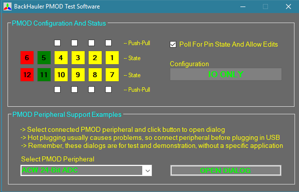

# BackHauler PMOD Open Source Software

This repository contains an open source project supporting the BackHauler PMOD, a Digilent PMOD compatible host module for Windows. The repository includes firmware for the Silicon Labs microcontroller on the module itself, drivers to connect the module to a Windows USB port, executable code with a Windows installation package, and a Visual Studio .NET solution for the Windows source code. A simple GUI provides direct access to the PMOD connector and peripheral-specific dialogs. The hardware and example dialogs are intended to make it easy to program an interface for a new PMOD peripheral in a Windows environment. 

**Figure 1**  BackHauler PMOD GUI

# Installation And Configuration

To get started, download or clone the repository and explore the folders. The BackHauler PMOD should have arrived already configured with the latest firmware. Install the Silicon Labs drivers from *Drivers* folder. Connect the BackHauler PMOD to a USB port. Run the installation executable from the *Application Installer* folder. The BackHauler PMOD should be ready to use.  

# About The Silicon Labs Drivers 

The repository includes the Silicon Labs USB Express drivers from the USB Express SDK materials, which are freely available from the Silicon Labs website, but are included here in order to preserve a complete image of what was used to compile and test the associated code. It might be advisable to visit www.silabs.com to locate the latest USB Express SDK. Historically, newer versions have required a driver update, replacement of libraries and header files in the code base, and a recompile, but little else.

The prescribed way to install the Silicon Labs environment is to either install the USB SDK and/or the drivers only, using the appropriate installer in the *Drivers* folder, and then plug in the BackHauler PMOD.  The BackHauler PMOD will be identified as a USB Express device. That is, it is equivalent to a Silicon Labs development kit in this respect, with the same USB device codes and so on, and it is in fact generally similar to such a development kit. Silicon Labs provides excellent instructions for paths to custom product variations, but those steps did not seem appropriate for a product where all aspects should remain open and fluid as a development environment.

The libraries and header files associated with this version of the USB SDK are already located with the source code and executable files where they are needed. The firmware is built as a Kiel MicroVision project (Silicon Labs version available through the Silicon Labs website). 

# About The Windows Source Code

The top level source code is provided wrapped in a Microsoft Visual Studio 2012 solution. If software components are being used without recompiling in Visual Studio (of any version), then it will probably be necessary to run the application installer in order to install all compiler-specific libraries on which the API depends, such as C runtime libraries. The application installer does not install the drivers. If a different environment is used for any aspect of your own application, then compiled components should still be usable. For example, the API DLL should be callable from LabView while everthing lower on the stack also remains the same. The open source code leaves little doubt about what the components do or what they need to accomplish those tasks. All that said, it is still a primary assumption that most users of this product are .NET developers who will port the source code to their own preferred version of Visual Studio. Even if the choice of language is to be changed (for example, to use C# instead of Visual Basic) the source code should be fairly portable and useful in understanding of the hardware principles.  

Like most open source, the code is always being changed and refined, so there is no other documentation; but, there is also therefore no proprietary API to learn or any other such thing to struggle over. The code is simple, with few layers, and follows a structure similar to that suggested by Silicon Labs in their USB development documentation. As mentioned, the USB device codes are not even changed from those used for Silicon Labs development kits. Indeed, this is a living development project, and it is intended to remain that way, but it is also very usable and provides a clean set of examples to reference. 

The user manual, schematic, and component data for the BackHauler PMOD hardware itself can be found on the [product page](https://store.alliedcomponentworks.com/collections/open-hardware/products/backhauler-pmod). This is also typical of individual PMOD peripheral modules available from a number of vendors. The BackHauler GUI includes example dialogs for all Allied Component Works PMOD peripherals and some others as well. Writing a new dialog is a painless process for a developer familiar with the .NET environment. Skilled developers can also expand this work to create a more complete interface for a specific peripheral, to incorporate support for other programming languages, or to interface other software. However, the most common reason to add a new dialog is still to explore the features of a new component provided in the form of a PMOD peripheral. In order to support easy comprehension, the example dialogs are often limited and may require refinement for specific applications, but they do provide a powerful starting point that is generally usable even when porting to other hardware or operating systems.  

The source code is all free, and the BackHauler PMOD module itself is subsidized and therefore also fairly inexpensive. The objective is to provide an enabling resource to the developer and to encourage ongoing discussion. Indeed, the PMOD products are supported with a marketing justification; but not only from the point of view of encouraging customer interaction, but also to provide insight into the best potential use of resources. Therefore, Allied Component Works appreciates and depends on your feedback, which is critical to our ability to continue to support and improve these products. Thank you!

